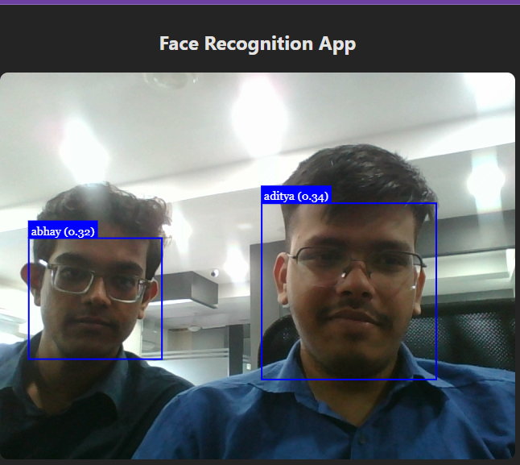

# Face Detection & Recognition App (React + Vite)

This project is a browser-based face detection and recognition app built with React, Vite, and face-api.js. It allows users to register their faces with a name, and then recognizes them in real-time using the webcam. The app also checks for low brightness and warns the user if the camera image is too dark.

## Features

- Real-time face detection and recognition using webcam
- Register multiple users with their face data and name
- Face data is persisted in browser localStorage (survives reloads)
- Displays 'Unknown' for unregistered faces
- Shows the match distance (threshold) for each detection
- Warns if the camera image is too dark

## How it works

1. Loads face-api.js models from `/public/models`.
2. Starts the webcam and displays the video.
3. User enters a name and clicks **Register** to save their face descriptor.
4. Registered faces are stored in localStorage and loaded on app start.
5. Clicking **Detect** starts real-time recognition, drawing boxes and names (or 'Unknown') on detected faces.
6. If the average brightness of the camera image is too low, a warning is shown.

## Project Structure

- `src/components/FaceRecognitionApp.jsx` — Main React component for face registration and recognition
- `src/App.jsx` — App entry, renders FaceRecognitionApp
- `src/main.jsx` — React root
- `src/index.css` — App styles
- `public/models/` — Face-api.js model files (required for detection/recognition)

## Getting Started

1. Install dependencies:
   ```bash
   npm install
   ```
2. Start the development server:
   ```bash
   npm run dev
   ```
3. Open [http://localhost:3000](http://localhost:3000) in your browser.

## Usage

- Allow webcam access when prompted.
- Enter your name and click **Register** to save your face.
- Click **Detect** to start recognition. The app will label faces with the registered name or 'Unknown' and show the match distance.
- If the image is too dark, a warning will appear.

## Dependencies

- [React](https://react.dev/)
- [Vite](https://vitejs.dev/)
- [face-api.js](https://github.com/justadudewhohacks/face-api.js)

## Notes

- Face descriptors are 128-dimensional vectors generated by face-api.js.
- All face data is stored in browser localStorage and is not shared between browsers or devices.
- The app does not require a backend server.


## output
